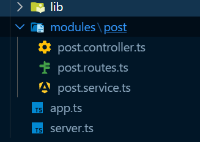
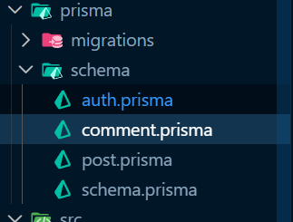
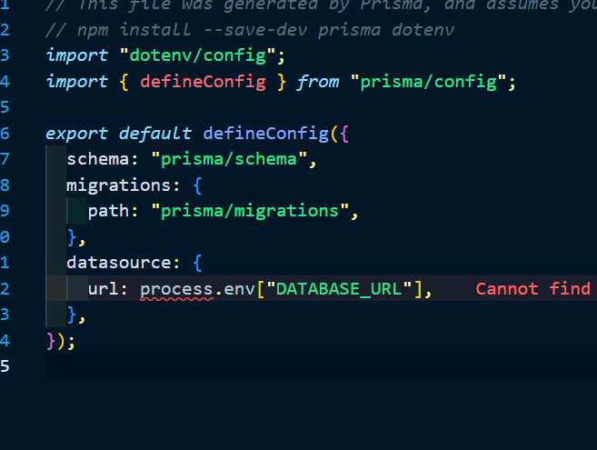
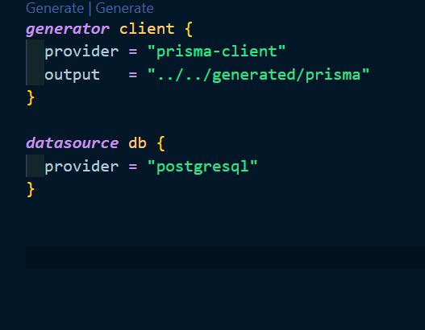

1. (1-10 setup Part) firstly,Initialize a TypeScript project:

        npm init -y
        npm install typescript tsx @types/node --save-dev
        npx tsc --init
        
2. Install required dependencies

        npm install prisma @types/pg --save-dev
        npm install @prisma/client @prisma/adapter-pg pg dotenv

3. Initialize Prisma ORM

        npx prisma init --datasource-provider postgresql --output ../generated/prisma

4. Express js framework 

        npm install express cors

5. Go to tsconfig.json   

        (
           1. uncomment -    // "outDir": "./dist",
              comment // "jsx": "react-jsx", // "verbatimModuleSyntax": true,
           
           2. “From Configure ESM support, match and add what needs to be added.”
               https://www.prisma.io/docs/prisma-orm/quickstart/prisma-postgres 
                
                {
                "compilerOptions": {
                "module": "ESNext",
                "moduleResolution": "bundler",
                "target": "ES2023",
                "strict": true,
                "esModuleInterop": true,
                "ignoreDeprecations": "6.0"
                 }
                }            
               
               in tsconfig.json so you will add last 
               "include": ["src/**/*"],
               "exclude":["node_modules", "dist", "generated/prisma"]    
        )

        create src and in src you will careate server.ts  
        npm i --save-dev @types/node
        go to .env and password set 

6. Now write schema.prisma

        generator client {
        provider = "prisma-client"
        output   = "../generated/prisma"
        }

        datasource db {
        provider = "postgresql"
        }

        model Post {
        id         String     @id @default(uuid())
        title      String     @db.VarChar(255)
        content    String     @db.Text
        thumbnail  String?
        isFeatured Boolean    @default(false)
        status     PostStatus @default(PUBLISHED)
        tags       String[]
        view       Int        @default(0)

        authorId String //betterauth

        createdAt DateTime  @default(now())
        updatedAt DateTime  @updatedAt
        comment   Comment[]

        @@index([authorId])
        @@map("posts")
        }

        enum PostStatus {
        DRAFT
        PUBLISHED
        ARCHIVED
        }

        model Comment {
        id       String  @id @default(uuid())
        content  String  @db.Text
        authorId String //betterauth
        postId   String
        post     Post    @relation(fields: [postId], references: [id], onDelete: Cascade)
        parentId String?

        parent  Comment?  @relation("CommentReplies", fields: [parentId], references: [id] , onDelete: Cascade) //onDelete: Cascade
        replies Comment[] @relation("CommentReplies")

        status    CommentStatus @default(APPROVED)
        view      Int           @default(0)
        createdAt DateTime      @default(now())
        updatedAt DateTime      @updatedAt

        @@index([postId])
        @@index([authorId])
        @@map("comments")
        }

        enum CommentStatus {
        APPROVED
        REJECT
        }
       
        npx prisma migrate dev (name ---> init)
        npx prisma generate

7. Instantiate Prisma Client (In src create lib/prisma.ts) 

        import "dotenv/config";
        import { PrismaPg } from "@prisma/adapter-pg";
        import { PrismaClient } from "../../generated/prisma/client";

        const connectionString = `${process.env.DATABASE_URL}`;

        const adapter = new PrismaPg({ connectionString });
        const prisma = new PrismaClient({ adapter });

        export { prisma };

8. In src you will create app.ts 

        npm i --save-dev @types/express

        import express from "express"
        const app = express();

        app.get("/", (req, res) => {
        res.send("Hello,Prisma blog app");
        });
        export default app;

9. in server.ts you will add 

        import app from "./app";
        import { prisma } from "./lib/prisma";

        const PORT = process.env.PORT || 5000;

        async function main() {
        try {
        await prisma.$connect();
        console.log("Connected to the database successfully.");

        app.listen(PORT, () => {
        console.log(`Server is running on http://localhost:${PORT}`);
        });
        } catch (error) {
        console.error("An error occurred:", error);
        await prisma.$disconnect();
        process.exit(1)
        }
        }

        main(); 

        in .env you will add PORT=5000

10. Run Server 

        npx tsx src/server.ts
        npx tsx watch src/server.ts 

        or in package.json you will add 
        "dev": "npx tsx watch ./src/server.ts"
        npm run dev   (but recomended)

------------------------------------------------X-----------------------------------------------------

11. https://github.com/Apollo-Level2-Web-Dev/prisma-blog-server/tree/part-2

12. Now make API (follow this structure for (post,comment) )

13.  

14. Go to Better auth

        https://better-auth.com/docs/installation
        npm i --save-dev @types/cors
        npm install better-auth
        BETTER_AUTH_SECRET=
        BETTER_AUTH_URL    
        in lib you create auth.ts

        import { betterAuth } from "better-auth";
        import { prismaAdapter } from "better-auth/adapters/prisma";
        import { prisma } from "./prisma";
        import nodemailer from "nodemailer";

        const transporter = nodemailer.createTransport({
        host: "smtp.gmail.com",
        port: 587,
        secure: false, // use STARTTLS (upgrade connection to TLS after connecting)
        auth: {
        user: process.env.APP_USER,
        pass: process.env.APP_PASS,
        },
        });

        export const auth = betterAuth({
        database: prismaAdapter(prisma, {
        provider: "postgresql",
        }),
        trustedOrigins: [process.env.APP_URL!],
        user: {
        additionalFields: {
        role: {
                type: "string",
                defaultValue: "USER",
                required: false,
        },

        phone: {
                type: "string",
                required: false,
        },

        status: {
                type: "string",
                defaultValue: "ACTIVE",
                required: false,
        },
        },
        },

        emailAndPassword: {
        enabled: true,
        autoSignup: true,
        requireEmailVerification: true,
        },

        emailVerification: {
        sendOnSignUp: true,
        autoSignInAfterVerification: true, 
        sendVerificationEmail: async ( { user, url, token }, request) => {
        try{
                const verificationUrl = `${process.env.APP_URL}/verify-email?token=${token}`;
                const info = await transporter.sendMail({
                from: '"Prisma Blog" <shakil.aiub.cse@gmail.com>', // sender address
                to: user.email, // list of recipients
                subject: "Please Verify your email", // subject line
                html: `<!DOCTYPE html>
        <html lang="en">
        <head>
        <meta charset="UTF-8" />
        <meta name="viewport" content="width=device-width, initial-scale=1.0" />
        <title>Email Verification</title>
        
        </head>
        <body>
        

                <!-- Header -->
                

                <h1>Prisma Blog</h1>
                

                <!-- Content -->
                

                <h2>Verify Your Email Address</h2>
                

                        Hello ${user.name}   
                        Thank you for registering on <strong>Prisma Blog</strong>.
                        Please confirm your email address to activate your account.
                

                

                        <a href="${verificationUrl}" class="verify-button">
                        Verify Email
                        </a>
                

                

                        If the button doesn't work, copy and paste the link below into your browser:
                

                

                        ${verificationUrl}
                

                

                        This verification link will expire soon for security reasons.
                        If you did not create an account, you can safely ignore this email.
                

                

                        Regards,  
                        <strong>Prisma Blog Team</strong>
                

                

                <!-- Footer -->
                

                © 2025 Prisma Blog. All rights reserved.
                

        

        </body>
        </html>`, // HTML body
                });

                console.log("Message sent: %s", info.messageId);
        }catch(err){
                console.error(err)
                throw err;
        } 
                
        },//---------------------------------
        },

        socialProviders: {
                google: { 
                prompt: "select_account consent",
                accessType: "offline",
                clientId: process.env.GOOGLE_CLIENT_ID as string, 
                clientSecret: process.env.GOOGLE_CLIENT_SECRET as string, 
                }, 
        },
        });

        you add in app.ts
        app.all("/api/auth/*splat", toNodeHandler(auth));

15. Enable Email and Password so you will go to app.ts (check npx prisma studio)

        follow my repo auth.ts and app.ts-----------------------------------link
        npm i --save-dev @types/cors

16. Email verified
  
        npm i nodemailer
        npm i --save-dev @types/nodemailer
        Check my repo auth.ts-----------------------------------------------link
        npx prisma format
        npx @better-auth/cli generate 
        npx prisma migrate dev (auth)
        npx prisma generate

17. Authentication Middleware Part and in src you create middleware and auth.ts 

        import { NextFunction, Request, Response } from "express";
        import { auth as betterAuth } from '../lib/auth'

        export enum UserRole {
        USER = "USER",
        ADMIN = "ADMIN"
        }

        declare global {
        namespace Express {
                interface Request {
                user?: {
                        id: string;
                        email: string;
                        name: string;
                        role: string;
                        emailVerified: boolean;
                }
                }
        }
        }

        const auth = (...roles: UserRole[]) => {
        return async (req: Request, res: Response, next: NextFunction) => {
                try {
                // get user session
                const session = await betterAuth.api.getSession({
                        headers: req.headers as any
                })

            if (!session) {
                return res.status(401).json({
                    success: false,
                    message: "You are not authorized!"
                })
            }

            if (!session.user.emailVerified) {
                return res.status(403).json({
                    success: false,
                    message: "Email verification required. Please verfiy your email!"
                })
            }

            req.user = {
                id: session.user.id,
                email: session.user.email,
                name: session.user.name,
                role: session.user.role as string,
                emailVerified: session.user.emailVerified
            }

            if (roles.length && !roles.includes(req.user.role as UserRole)) {
                return res.status(403).json({
                    success: false,
                    message: "Forbidden! You don't have permission to access this resources!"
                })
            }

            next()
        } catch (err) {
            next(err);
        }

    }
        };

        export default auth;

18. Admin Seed in src you will create scripts and create seedAdmin.ts

        import { prisma } from "../lib/prisma";
        import { UserRole } from "../middlewares/auth";
        import { auth } from "../lib/auth";

        async function seedAdmin() {
        try {
                console.log("***** Admin Seeding Started....")

        const adminData = {
            name: process.env.ADMIN_NAME!,
            email: process.env.ADMIN_EMAIL!,
            password: process.env.ADMIN_PASSWORD!
        }

        if (!adminData.name || !adminData.email || !adminData.password) {
            throw new Error("Admin credentials missing in .env file");
        }

        console.log("***** Checking Admin Exist or not")
        const existingUser = await prisma.user.findUnique({
            where: { email: adminData.email }
        });

        if (existingUser) {
            throw new Error("User already exists!!");
        }

        await auth.api.signUpEmail({
            body: {
                name: adminData.name,
                email: adminData.email,
                password: adminData.password,
            }
        })

        console.log("**** Admin created")
        await prisma.user.update({
            where: { email: adminData.email },
            data: {
                emailVerified: true,
                role: UserRole.ADMIN
            }
        })
        console.log("**** Email verification status updated!")
        console.log("******* SUCCESS ******")

        } catch (error) {
                console.error(error);
                process.exit(1);
        } finally {
                await prisma.$disconnect();
        }
                }

        seedAdmin()

        Go to package.json and add 
        "seed:admin": "npx tsx src/scripts/seedAdmin.ts"
        npm run seed:admin

21. Offset Pagination And Cursorbased Pagination and Pagination And Sorting(In src create helper file and create paginationSortingHelper.ts)

        skip=(page-1)*limit

        type IOptions = {
        page?: number | string;
        limit?: number | string;
        sortOrder?: string;
        sortBy?: string;
        }

        type IOptionsResult = {
        page: number;
        limit: number;
        skip: number;
        sortBy: string;
        sortOrder: string;
        }

        const paginationSortingHelper = (options: IOptions): IOptionsResult => {
        const page: number = Number(options.page) || 1;
        const limit: number = Number(options.limit) || 10;  //Default limit is 10
        const skip = (page - 1) * limit

        const sortBy: string = options.sortBy || "createdAt";
        const sortOrder: string = options.sortOrder || "desc";
        return {
                page,
                limit,
                skip,
                sortBy,
                sortOrder
        }
        }

        export default paginationSortingHelper;

        Follow my repo controller.ts and Service.ts file

22.    Comment Router Setup
       
        check my repo commentpart and post

23. Admin Comment Status Management

        check my repo commentpart

24. Multi-File Schema Architecture
 
        Go to Prisma
        create schema file
        
        
        
        /// <reference types="node" />
         npx prisma migrate dev
         npx prisma generate
         npm run dev

  
